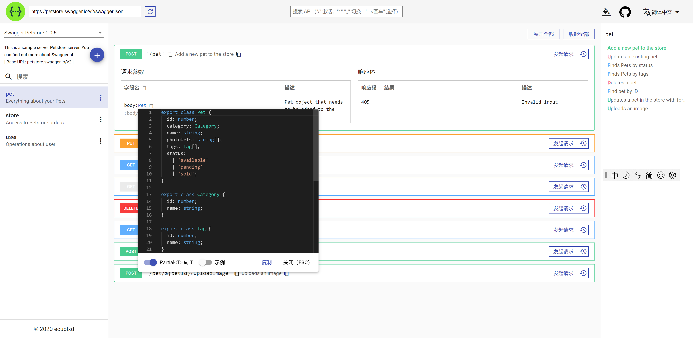
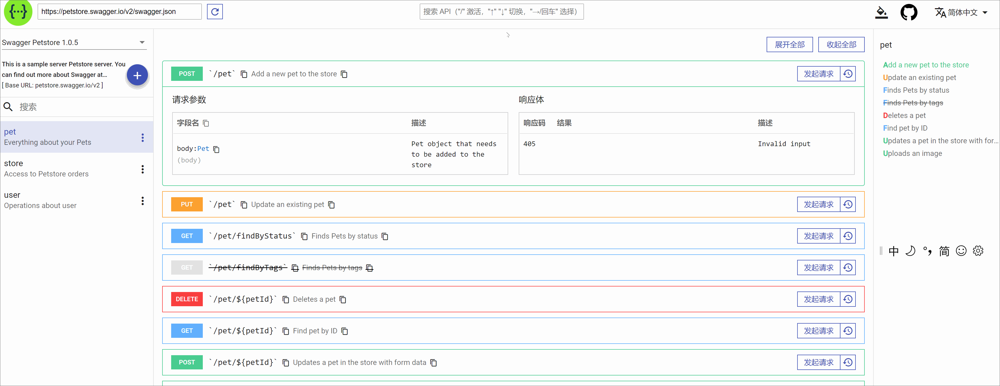
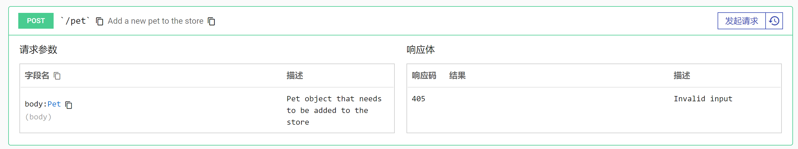
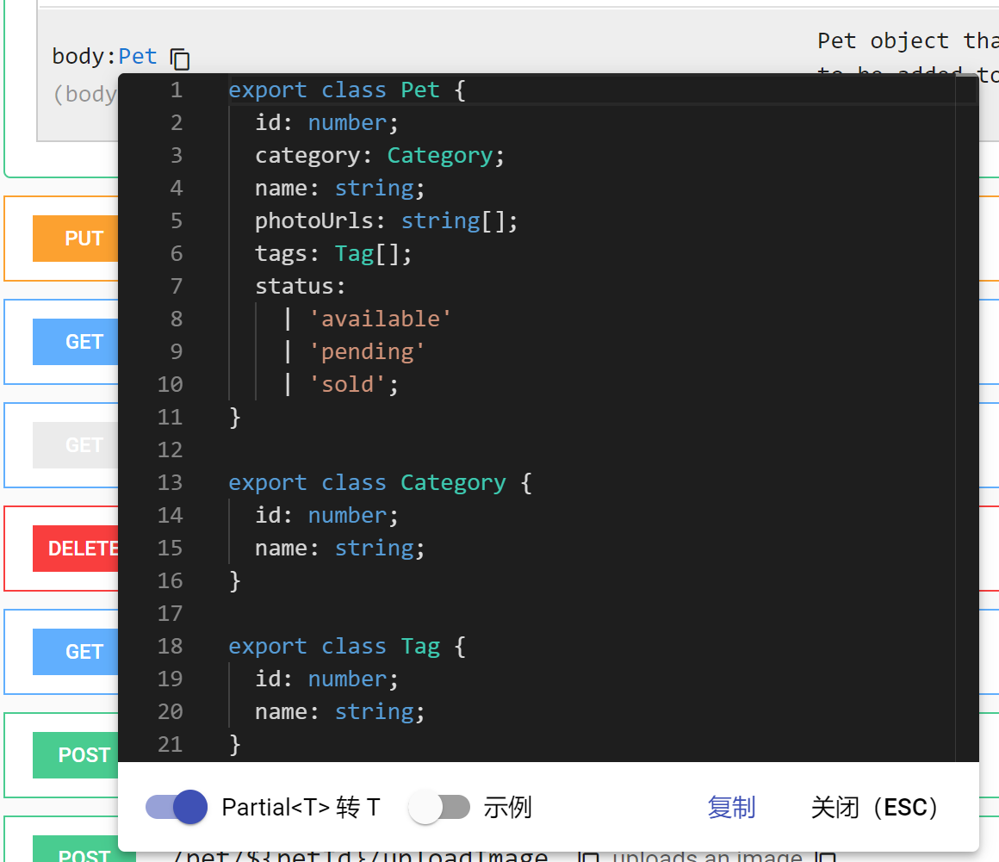
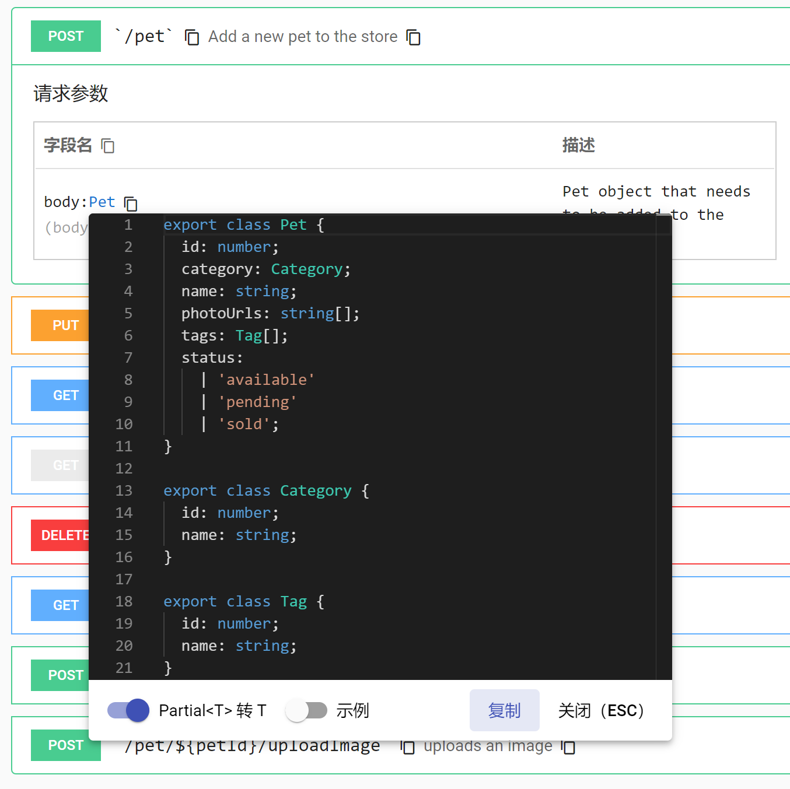

# Swagger Ui

# Feat
See preview part for detail.

# Preview

## Main

## Submenu

## Search

## Expand API Item

## Type Hover

## Copy Type & URL & Request Params

# TODO

- [x] Try it out
- [x] unit test
- [x] i18n
- [x] change theme
- [x] toggle side nav
- [ ] add shortcut
- [ ] global setting
- [x] favorite

# DEV

## Development server

Run `ng serve` for a dev server. Navigate to `http://localhost:4200/`. The app will automatically reload if you change any of the source files.

## Code scaffolding

Run `ng generate component component-name` to generate a new component. You can also use `ng generate directive|pipe|service|class|guard|interface|enum|module`.

## Build

Run `ng build` to build the project. The build artifacts will be stored in the `dist/` directory.

## Running unit tests

Run `ng test` to execute the unit tests via [Karma](https://karma-runner.github.io).

Note: `ng test:ci` only for github actions.

## Further help

To get more help on the Angular CLI use `ng help` or go check out the [Angular CLI README](https://github.com/angular/angular-cli/blob/master/README.md).

#
-red.svg)
